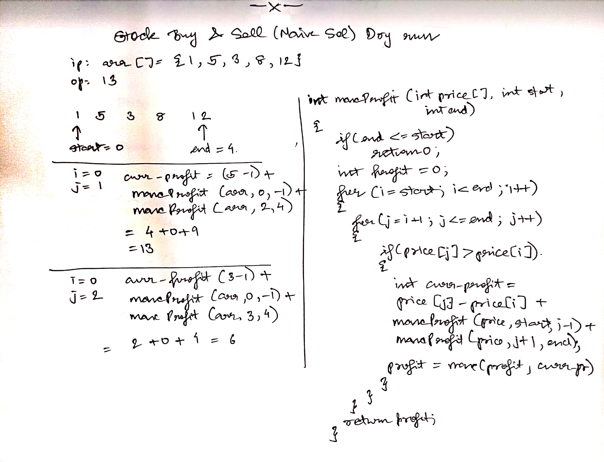

## Intro
- used to store multiple items of same data-type in a sequential format
- els are stored at contigous locations
- if we type only ```arr```, it gives addr of arr[0]
    - ```addr of arr[2] = arr + 2*sizeof(data-type)```

## Adv of arrays
- random access
- cache friendliness

## Operations on array 

1) Searching unsorted arr

Function returns index of el x, else -1 if el is absent

```
int search(int arr[], int n, int x)
{
    for(int i = 0; i<n; i++)
        if(arr[i] == x)
            return i;
    return -1;
}
```

2) Inserting an element at some position

Function return 0 if el was not inserted, else 1
```
bool insert(int arr[], int n, int x, int pos)
{
    // arr is full, no new el can be inserted
    if(n==cap)
        return 0;

    int idx = pos - 1;

    // move all els from idx to n-1 one position ahead
    for(int i = n-1; i >= idx; i--)
        arr[i+1] = arr[i];
    arr[idx] = x;

    return 1;
}
```

3) Delete an element (only first occurence)

Function returns 1, if element is deleted
else -1, if el is not present

```
int deleteEl(int arr[], int n, int x)
{
    int i;
    for(i = 0; i<n; i++)
        if(arr[i] == x)
            break;

    if(i==n)
        return -1;
    
    for(int j = i; j < n-1; j++)
        arr[j] = arr[j+1];

    return 1;
}
```

## Summary of array operations

```
Insert: O(n)
Search: O(n) for unsorted
        O(logn) for sorted
Delete: O(n)    
Get ith element: O(1)
Update ith el: O(1)
```

## Problems on arrays

- [largest element in an array](largest.cpp)
- [Check if an array is sorted](isSorted.cpp)
- [Reverse an array](reverse.cpp)
- [Remove duplicates from a sorted array](remove_duplicates.cpp)
- [Move all zeroes to end](move_zeroes.cpp)
- [Left rotate an array by d steps](left_rotate.cpp)
- [Leaders in an array](leaders.cpp)
    - print els that have nothing greater to the right of it
- [Maximum diff](max_diff.cpp)
    - max diff of ```arr[j]-arr[i]``` such that ```j>i```
- [Frequencies in a sorted array](freq.cpp)
- [Stock buy and sell](stock_buy_and_sell.cpp)
    - dry run
    - 
- [Trapping Rainwater TBD]()
- [Maximum consecutive ones](max_consecutive_ones.cpp)
- [Maximum Sum Subarray](maxsum_subarr.cpp)
    - dry run
- [Maximum length even-odd subarray](maxlen_subarr.cpp)

**Sliding Window**

- a common hint would be array contains non-negative ints
- [Maximum sum of k contigous elements](Sliding_window/max_sum_k_consecutive_els.cpp)
- [Subarray of size k with given sum](Sliding_window/subarray_size_k_given_sum.cpp)
- [Subarray of any size with given sum for an unsorted array having non-negative ints](Sliding_window/subarray_any_size_given_sum.cpp)
- [N-bonacci numbers](Sliding_window/nbonacci.cpp)
- [Count distinct elements in every window of size k TBD code](Sliding_window/count_dist_els_of_window_size_k.cpp)