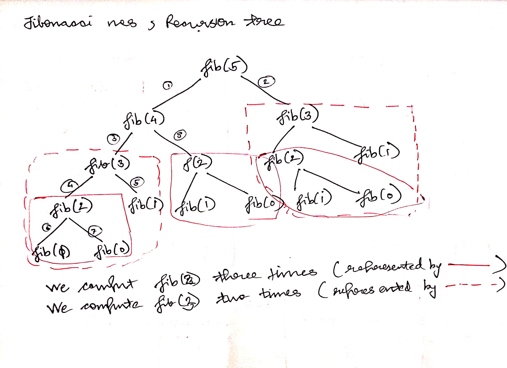
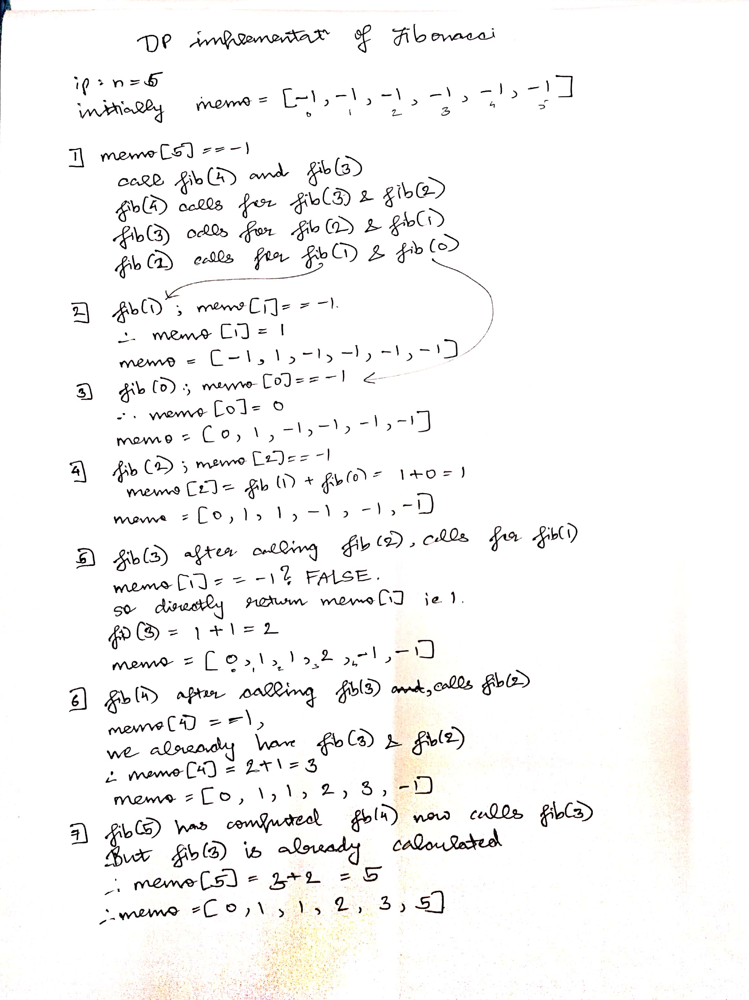
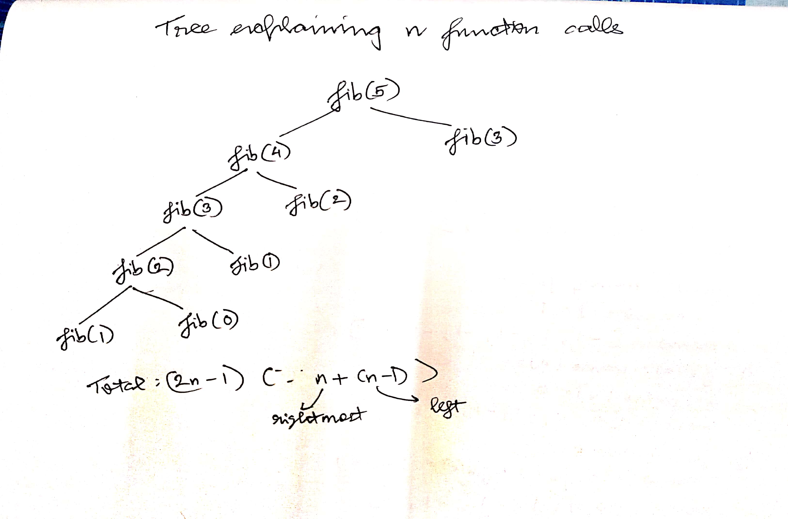

# DP intro
- in simpler words it is optimisation over plain recursion
- in plain recursion, we are given an input of size n, we use the solution of sub-problems of maybe size: n-1 or n-a or n/a, etc
- we recursively call the same problem for sub-problems, to get solutions of sub-problems and use those to compute the main problem
- in plain recursion if we are solving some sub-problems again and again then we can optimised the solution by storing these solution. We use those stored solution whenever we face the problem again
- basically RE-USE the solutions of sub-problems when there are overlapping sub-problems

# Applications of DP algorithms
- Bellman Ford Algorithm for finding shortest path from source to destinations (used in routing)
- Floyd Warshall Algorithm for finding shortest path between every pair of vertices 
- Diff utility i.e difference between two files in a file tracking software or version control systems eg: Git 
    - based on Longest common subsequence (LCS) problem
- Seach closed words: Given a dictionary of words and you are given a word that is absent in dictionary, we want to find the closest matching word present in dictionary 
    - based on Edit Distance problem
- Resource allocation: we have some financial constraints, and a budget, things to acquire that have some value and cost
    - based on 0/1 knapsack problem


# ways of implementing DP
- Memoization (Top Down)
- Tabulation (Bottom up)

# Memoization

```
Consider finding nth fibonacci number 

ip: n=3, op: 2
ip: n=0, op: 0

Recursive sol:

int fib(int n)
{
    if(n==0 || n==1)
        return n;
    return fib(n-1) + fib(n-2);
}
```

- Time: O(2^n) or (golden_ratio^n)

- recursive tree for above program that shows the repititive compuatations for same sub-problems 



- with memoization, we can reduce the time to O(N)

- memoization implementation
```

int memo[n+1] = {-1, -1, ... -1}

int fib(int n)
{
    if(memo[n] == -1)
    {
        int res;
        if(n==0 || n==1)
            res = n;
        else 
            res = fib(n-1) + fib(n-2);
        
        memo[n] = res;
    }
    return memo[n];
}

```

- Notice, that block of code inside if, is similar to recursive code, but instead of returning the value, we are storing it in res variable
- memo is an array initialised to -1 of size n+1
- memo is being used by fib function to find out whether a particular solution has been computed or not 
- if ```memo[n] or memo[i] == -1``` means we haven't computed this solution, so we compute it using recursion 
    - we initialised memo as -1 since fib of any no cannot be negative 

- else if it has been already computed i.e if ```memo[i] != -1```, ```return memo[n]``` or ```memo[i] (iterative)``` since memo[n] will already has ans for that fib(n)




**Personal Note :** basically you can consider n going from it's original value of n to 0 and then again going from 0 to n but each step will have results

## Summary of memoization
- the no of dimensions of memo arr depends on no of parameters that are changing 
- size is determined by min and max value of that parameter 
    eg: min was 0 and max was n, so we took n+1 as array size
- you initialise memo array with values that cannot be the answer for any case 
-  The toughest part of DP is not memoization but to come up with recursive solutions having overlapping sub-problems 
- why is this called top-down? <br>
we begin from main problem and then calling for sub-problems and every moment check if we have already computed the solution for this sub-problem

# Tabulation
- leave recursion
- have an array or table and build a solution in bottom-up manner 
- i.e we compute solution for the smallest sub-problem first and build it upto n 
- In other words, if sol for n is depended upon n-1 and n-2, they will be already computed in this case
- tabulation implementation

```
int fib(int n)
{
    int dp[n+1];
    // initialise solution for base-cases
    dp[0] = 0, dp[1] = 1;

    // compute remaining sub-problems
    for(int i = 2; i <= n; i++)
        dp[i] = dp[i-1] + dp[i-2];

    return dp[n];
}
```

- complexity 
```
theta(n) time
theta(n) aux space
```

- recursive tree for above


## Summary of Tabulation
- the no of dimensions of memo arr depends on no of parameters that are changing 
- size is determined by min and max value of that parameter 
    eg: min was 0 and max was n, so we took n+1 as array size
- In case of tabulation **we need to take care of depedency** <br>
If main problem is dependent upon n-3, n-1.... <br>
In those case, make sure that while filling entry n, <br>
we have answers ready for n-3 and n-1 i.e these values are already present in table

**Note: we can find fib(n) in O(logn) time using matrix multiplication based on divide and conquer, so DP is not the best solution for finding fib(n)**

**For some non-sensical reason DP doesn't usually involve anything dynamic even if the name is Dynamic Programming**

# Memoization vs Tabulation
- Memoization is very easy to implment once you have recursive solution but Tabulation can be difficult to implement esp in case of 2D arrays 
- However tabulation does not involve any recursive function call overhead
- Typically tabulation based solution are faster and memoization based solutions are easy to implement IF we have recursive solution
- mostly please try to write recursive solution

# Longest common subsequence

- a subsequence of a string can be obtained by picking 0 or more chars from it and these chars should be picked in same order as they appear in string
- in a string of len n, there can be 2^n subsequences
- [longest common subsequence (recursive sol)](longest_common_subsequence_recursion.cpp)

- recursion tree


- [longest common subsequence (memoization sol)](longest_common_subsequence_memoization.cpp)
- [longest common subsequence (tabulation sol)](longest_common_subsequence_tabulation.cpp)

- filling of dp table for tabulation 


## Variations of LCS
- diff utility
- minimum insertions and deletions to convert s1 into s2
    - find LCS and then perform deletion or insertion on s1/s2
    - first string is of len m, second is of len n, and LCS string is of len l, then we need to do (m-l) deletions and (n-l) insertions to convert s1 into s2

- shortest common supersequence
    - given two strings find third string which has both the strings as subsequence such that it's len is minimum 
    - we do this by finding out LCS and then putting extra chars of both s1 and s2

- longest palindromic subsequence
    - given a string, find out longest subsequence that is a palindrome 
    - create another string s2 which is reverse of s1, whatever is the LCS of s1,s2 is the answer 

- longest repeating subsequence
    - create another string s2 which is copy of s1
    - if last two chars match and indexes are different 
- space optimised DP solution of LCS
- printing LCS
    - we can use 2D DP array used in tabulation, we can start traversing from bottom-right, if both chars are matching goto diagonal else take max of upper and lower and go in that direction 

# Coin change (count combinations)

Given an array of coin types or values and a sum, find total posiible ways to get sum using given types or values of coins

- [recursive and tabular coin change](coin_change_recursive.cpp)

- [TBD: space optimised sol for coin change]()
 ![bhay add kar dena]

# Edit distance

Given two strings s1 and s2, convert s1 into s2 by doing 3 operations: insert, delete and replace. <br>
what is the minimum number of operations to convert s1 -> s2

```
ip: s1="CAT", s2="CUT"
op: 1 (replace instead of delete, insert)

ip: s1="GEEK", s2="GEEKS"
op: 1 (insert)

ip: s1="SATURDAY", s2="SUNDAY"
op: 3 (delete A, T) and replace R with N
```

Application of Edit distance:
- suggesting spelling errors: if you type spelling of a word wrong, we can use edit distance to find closest distance that is present in dictionary
- also has applications in bio-informatics
<br> 

- [Recursive sol for edit distance problem](edit_distance_recursive.cpp)

![Dry run pleash add kar diyo]

- [DP sol for edit distance problem](edit_distance_dp.cpp)

![Dry run not drawn yet]