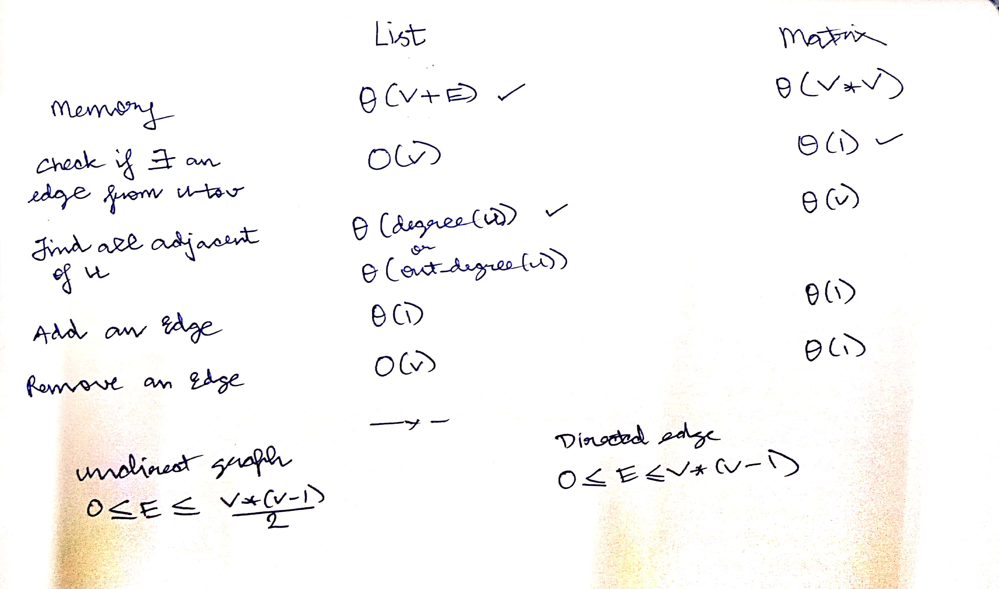

# Intro

- Consider a friendship relationship where anyone person can be friends with any other person, there can be cycles, we cannot represent such a relationship with Tree
- So whenever we have random conncetions among nodes, we use Graph DS
- Graph is represented by pair of sets 
```G = (V, E)```
- V is set of vertices, V = {v1, v2..}
- E set of edges, E = {(v1, v2), (v3, v4),...}

## Directed vs Undirected graph 
- In undirected graphs the edge is unordered i.e (v1, v2) is same as (v2, v1) but in a directed graph both pair have different meanings since they are ordered pairs 
- Real word eg of undirected graph: social network, if v1 is friend of v2, this means, v2 is a friend of v1
- Real word eg of directed graph: World wide web, if we consider vertices as web-pages then pair (v1, v2) will mean page v1 has link to page v2 and but vice versa is not true

# Terms

1. Degree of a vertex: 

- For undirected graph: No of egdes going through that vertex
- For directed graph: 
    - InDegree: no of edges coming to the node 
    - OutDegree: no of edges coming out of the node 

2. Relation b/w degree and no of edges:
- For undirected graph: ```sum of indegrees = sum of outdegrees = | E |```
- For directed graph: ```sum of degrees = 2 * | E |```

3. Maximum edges (excluding the possibility of self loops):

- For undirected graph(4 edges for each): ```V*(V-1)``` 
- For directed graph(2 edges for each): ```V*(V-1)/2```

4. Walk: a sequence of vertices that we get **by following edges** 
- eg: v1, v2, v4, v2

5. Path: a path is a special walk with no repitition of vertices 
- eg: v1, v2, v4

6. Cyclic graph: a graph is called cyclic if there exists a walk in the graph that begins and ends with same vertex (cyclic graphs can be directed as well as undirected)

7. Acyclic graph: a graph that does not contain a cycle is called acyclic (acyclic graphs can be directed as well as undirected
- Directed acyclic graph (DAG) has many applications like job scheduling algorithm, topological sorting 

8. Weighted Graph: A graph that has weights assigned to it's edges. It can be directed or undirected. 
- A real life example is a graph of road networks, where roads are connected to multiple cities and weight of edges is determined by length of the road. 
- If two cities are far away from each other then the road or edge that connects these two cities has more weight comapred to closer cities 
- A similar example is with routers in computer networks 

# Graph representation

## Adjacency Matrix 
- create a matrix of size V * V
```
mat[i][j] = 1, if there is an edge from vertex i to j
          = 0, otherwise 
```
- For an undirected graph, adjacency matrix is symmetric matrix i.e lower triangle and upper triangle are mirror images of each other along the diagonal

### How do we represent a graph having vertex name as strings eg graph of cities 
In that scenario we need additional data structure: array, <br>
so we can use corresponding index for a city name in adj matrix, but let's say we have to find index of city "CDE", so I will have to linearly traverse, so for efficient implementation, one hash table ```h``` would also be required to do reverse mapping
```
h {ABC} = 0
h {CDE} = 2
...
```

### Properties of adjacency matrix
- Space required: ```θ(V x V)```
- check if u and v are adjacent: ``θ(1)``
- find all vertices adjacent to u: ``θ(v)``
- find degree of u: ``θ(v)`` - count no of ones in u row
- add/remove an edge: ``θ(1)`` - changing cell value
- add/remove a vertex: ``θ(v^2)`` - create a bigger matrix and copy the matrix

## Adjacency List 

### Problems of adj matrix:
- stores redundant info i.e vertices which are not connected to a specific vertex
- these makes finding all adjacent of a vertex operation faster, this operation is used in lot of algos 

- Hence in adjacency list we only store vertices that are adjacent to it
- we maintain an array of list, the list could be LinkedList, dynamic sized arrays, etc
- we use index as vertex number 

### Properties of adjacency matrix
- Space required: 
    - undirected: ```θ(V + 2E)```
    - directed: ```θ(V + E)```
    - v sized array, in undirect every edge contributes 2 cells

- check if u and v are adjacent: ```O(v)``` - go to uth index and traverse that list till we reach v
- find all vertices adjacent to u: ```θ(degree(u))```
- find degree of u: ```θ(1)``` - count no of ones in u row
- add an edge: ``θ(1)`` - add as first node
- remove an edge: ```O(v)``` - create a bigger matrix and copy the matrix

# Diff b/w adjacency list and matrix

-  if you write BFS, Dijktra's code using adjacency list it is ```O(V+E)``` but if u use adj matrix it is ```>θ(v*v)``` since these algos need to find adj vertices of u
<p align="center">
  
</p>

# Important snippets

- Traversing boundary elements of matrix n x m
```
for (int r = 0; r < n; r++){
    for (int c = 0; c < m; c++) {
        if(r == 0 || c == 0 || r == n-1 || c == m-1){
            // r,c will be boundary element
        }
    }
}
```
- Traversing up, down, left, right neighbours
```
int delta_row[] = {-1, 0, 1, 0};
int delta_col[] = {0, 1, 0, -1};

for (int i = 0; i < 4; i++)
{
    int nrow = r + delta_row[i];
    int ncol = c + delta_col[i];
    if(nrow >= 0 and nrow < n and ncol >= 0 and ncol < m)
    {
        // extra check for land/aanything goes here
            // DFS or BFS 
            // dfs(neighbour_row, neighbour_col, visited, grid);
    }
}
```

# Questions

- [Breadth-first-search (BFS)](BFS.cpp)
- [Depth-first-search (DFS)](DFS.cpp)
- [Number of Provinces | no of components](no_of_provinces.cpp)
- [Number of Islands | Number of Connected Components in Matrix](no_of_islands.cpp)
- [Flood Fill using DFS](flood_fill.cpp)
- [Rotten Oranges | Min time | BFS](rotten_orange.cpp)
- [Surrounded Regions | Replace O's with X's | DFS](surrounded_regions.cpp)
- Number of Enclaves 
    - [Muti-source BFS | Traverse Boundary Elements](no_of_enclaves_bfs.cpp)
    - [Multi-source DFS](no_of_enclaves_dfs.cpp) 
- [Number of distinct islands | Leetcode premium](no_of_dist_islands.cpp)
- [Check if Graph is Bi-partite using BFS](check_bipartite.cpp)
- [Check if Graph is Bi-partite using DFS](check_bipartite_dfs.cpp)
- [Check for cycle in an Undirected graph using DFS](check_cycle_undirected_dfs.cpp)
- [Find Eventual Safe States using Cycle Detection(DFS) | TLE on leetcode](eventual_state.cpp)
- [Word Ladder-1 | len of Shortest path](word_lad_1.cpp)
- [Word Ladder-2 | **print all** the shortest paths | Interesting implementation](word_lad_2.cpp)

## Topological Sorting

- only for **Directed Acyclic Graphs (DAGs)**
- Topological Sort: [DFS](topological_sort.cpp) | [BFS (Kahn)](kahn_algo.cpp)
- Check for cycle in a Directed Graph [DFS](check_cycle_directed.cpp) | [BFS (Kahn's algo)](check_cycle_directed_bfs.cpp)
- [Course Schedule - 1 | Only check | Using Kahn(BFS)](course_1.cpp)
- [Course Schedule - 2 | Print order | Using Kahn(BFS)](course_2.cpp)
- [Find Eventual Safe States using Kahn (BFS) | AC on leetcode](eventual_state_kahn.cpp)

## Shortest path
- [Nearest shortest distance to exit of maze | BFS](nearest_exit_entrance.cpp)

## Disjoint set

- [Union by Rank and Path Compression](union_by_rank.cpp)

## Misc

- [Min time to collect apples | create Graph using Adj | DFS](collect_all_apples.cpp)
