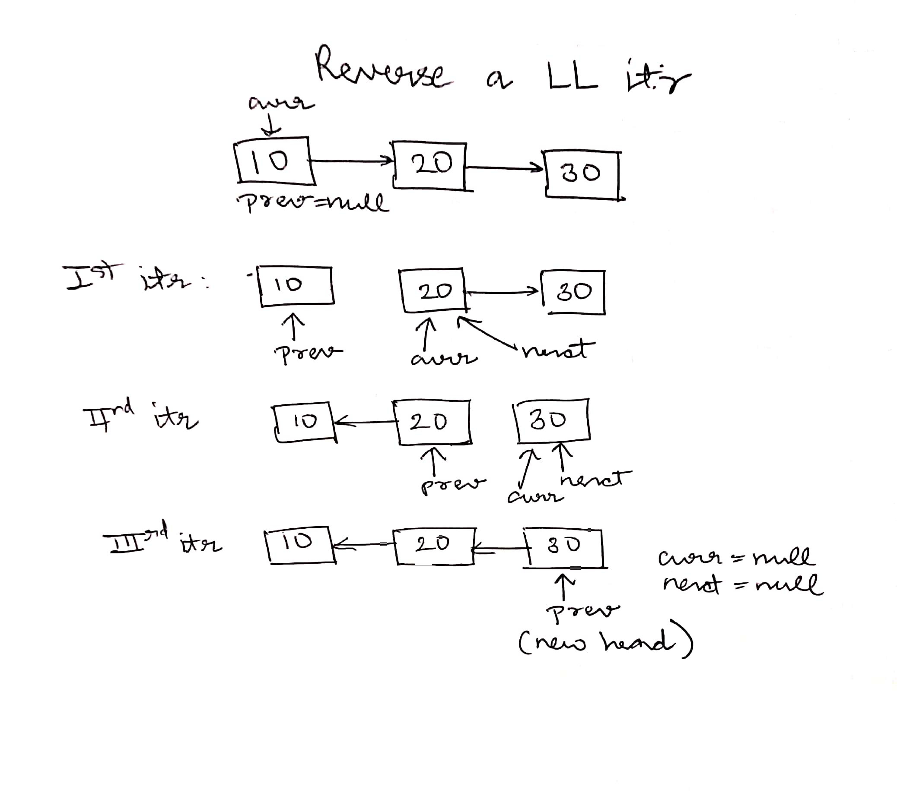
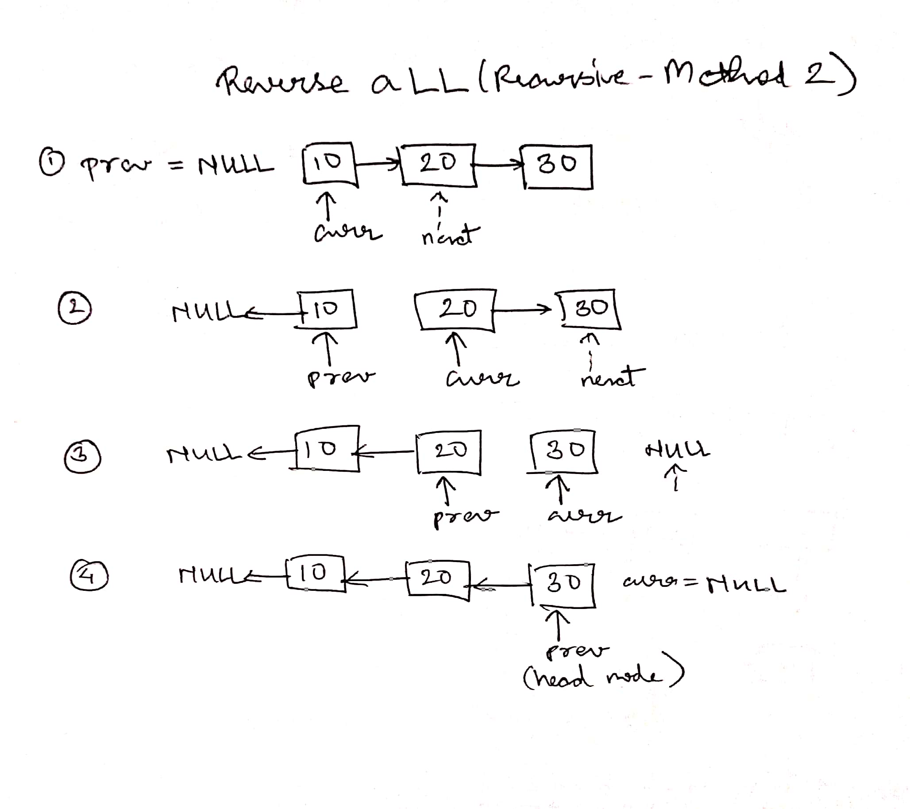
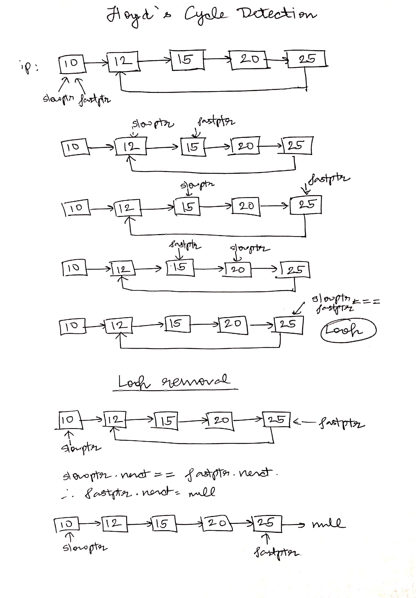
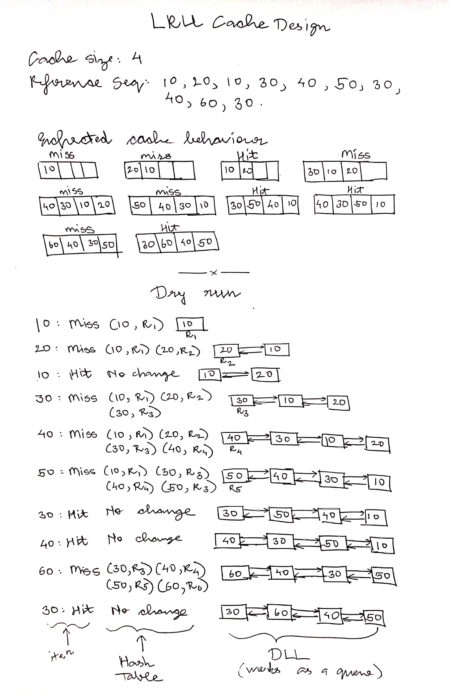

## Problems of arr/ Need of Linked List

- Elements don't have to be in contigous memory locations in LinkedList but in stack they have to
- worst case insertion at end is θ(n) 
- Insertion in the middle (or beginning) is costly
- Deletion from the middle (or beginning) is costly
- Implementation of data struct. like queue and deque is complex with arrays
- Implementation of round robin scheduling is much less complex and cost-friendly with circular LL rather than arrays, since we will need to re-size our list of processes and also perform insertion at the end of list
- basically any problem where insertion at middle/end is performed more no of times, LL is better suited for them

## Questions on Singly LL

- [Linked List implementation](Singly_Linked_List/LL_basic)
    - Why do LL have self-referential struct? <br>
        every node needs to have addr of next node, and datatype of next node is same as the current node
- [LL Traversal](Singly_Linked_List/LL_traversal)
- [Insert at beginning of Singly LL](Singly_Linked_List/insert_at_begin.java)
- [Insert at end (tail) of Singly LL](Singly_Linked_List/insert_at_end.java)
- [Delete first node(head) in Singly LL](Singly_Linked_List/delete_first_node.java)
- [Delete last node(tail) in Singly LL](Singly_Linked_List/delete_last_node.java)
- [Insert at given position in Singly LL](Singly_Linked_List/insert_node.java)
- [Search in a LL(iterative & recursive)](Singly_Linked_List/SearchNode.java)
    - we can't do binary search in logn time on LL, since we can't find middle node in O(1) time

## Doubly LL

- in doubly LL, we have ref to prev and next node 
- in struct/class node, a new attr will be added

```
class Node{
    int data;
    Node prev;
    Node next;

    Node(int d){
        data = d;

        // optional lines
        prev = null;
        next = null;
    }
}
```

- [Doubly Linked List implementation](Doubly_Linked_List/LL_basic.java)

### Advantages of Doubly LL over Singly LL:
- can be traversed in both directions
- delete a node in O(1) time with given ref/ptr to it
- insert/delete *before* a given node
- insert/delete from both ends in O(1) time by maintaining tail

### Disadvantages of Doubly LL over Singly LL:
- Extra space for prev
- Code becomes more complex

### Problems on DLL

- [Insert at head of DLL](Doubly_Linked_List/InsertAtHead.java)
- [Insert at tail of DLL](Doubly_Linked_List/InsertAtTail.java)
- [Reverse a DLL](Doubly_Linked_List/Reverse.java)
    - find dry run img [here](imgs/)
- [Delete head of DLL](Doubly_Linked_List/DeleteHead.java)
- [Delete tail of DLL](Doubly_Linked_List/DeleteTail.java)

## Circular LL

- in circular LL, next of last node is not null, it is head of the linked list
- struct of singular circular LL is same as of singly LL

- [Circular Linked List implementation](Circular_Linked_List/LL_basic.java)
- [CLL Traversal](Circular_Linked_List/LL_traversal.java)

### Advantages of Circular LL
-  we can traverse the whole list from any node
-  implementation of algorithm like round robin algo is much easier
```
Round Robin is CPU scheduling algo that we study in OS
In this algo, we maintain a queue of the proccesses, we traverse through this queue in circular manner, when a process finishes exec, it has to be removed from queue
hence we need to efficiently delete, traverse in circular manner, update the data
```
- We can insert at beginning and end by just maintaining one tail ref/ptr (useful for implementation of queue)

### Disadvantages of Circular LL
- Implementations of operations become complex

### Problems on CLL

- [Insert at head of CLL](Circular_Linked_List/InsertAtHead.java)
- [Insert at tail of CLL](Circular_Linked_List/InsertAtTail.java)
- [Delete head of CLL](Circular_Linked_List/DeleteHead.java)
- [Delete Kth node of CLL](Circular_Linked_List/DeleteKthNode.java)

## Circular Doubly LL

- in circular doubly linked list every node has two pointers or refs like normal doubly linked list
- In normal doubly LL, prev of first node is null, and next of last node is also null, but in Circular Doubly LL prev of last node is first node and next of last node points to head

### Advantages of CDLL
- we can access last node in constant time without maintaining extra tail ptr/ref
- similarly we have features of DLL, eg: you can delete or insert a node before a given node in constant time

### Inserting a node at head for CDLL

```
Node temp = new Node(x)
if(head == null)
{
    temp.next = temp;
    temp.prev = temp;
    return temp;
}

temp.prev = head.prev;
temp.next = head;

head.prev.next = temp;
head.prev = temp;

return temp;
```

for inserting at tail, it will be same, you just have to return original head ref at the EOF

## Misc Questions

- [Insert an item in a sorted SLL such that it remains sorted](sorted_insert_SLL.java)
- [Find middle el of LL](middle_el.java)
- [Reverse SLL iteratively](reverseSLL.java)
    - dry run
<p align="center">
  
</p>

- [Reverse SLL recursively](reverseSLL_recursive.java)
    - dry run
<p align="center">
  
</p>


- [Remove duplicates from a sorted Singly Linked List](removeDupliInSortedLL.java)

- [Find nth Node from end of Linked List](nthNodefromEnd.java)

- [Reverse a LL in groups of size k](reverseInSize.java)

- [Detect loop, huge no of tradeoffs](detectloop.java)
- [Detect loop using Floyd's Cycle Detection, works in O(n) time, O(1) space, no need to modify LL or it's struct, two ptrs method](floydCycleDetection.java)
- [Detect and Remove loop in SLL](detectandremove.java)
    - Find length of loop: Once we detect the loop, i.e when slowptr == fastptr, move any one ptr in reverse direction until they become equal again, while maintaining a count 
    - Find first node of loop
    - dry run
    <p align="center">
    
    </p>


- [Delete a node with only ptr given to it](randomDelete.java)
- [Segregate Even & Odd nodes for SLL](segregateEvenOdd.java)
- [Intersection point of two LL](intersectionPoint.java)
- [Intersection point of two LL Efficient](intersectionPointEfficient.cpp)
- [Pairwise swap nodes of a LL](pairwiseSwapNodes.java)
- [Clone a LL using a random pointer](cloneLL.java)
    - **input**
- [Merge two sorted lists](merge_sorted_lists.cpp)

### LRU Cache
- Cache is a memory viz close to CPU has very less access time i.e very fast small in size compared RAM    
- LRU(Least recently used) technique helps us to utilise the fast read/write of cache efficiently 

- in LRU we keep the recently accessed item in cache & remove least recently used items when we need space in small sized memory 

- Given a capacity, Design a data structure such that when you refer a item, if it's already present in data structure, mark it as most recently used, 
and if it's not present, we insert it and mark it as most recenly used
else if cache is full, remove least recently used item
and insert it and mark it as most recently used 

- Naive Approach: 
If we use an array
Hit: O(n) 
Miss: O(n)
where n is capacity if cache 

- Eff approach:
we need a DS which tells us 
1) Whether an item is present or not
2) Insertion <br>
so hashtable will be great for this usecase 
but how do we maintain an order for recency?
for that purpose we use doubly linked list i.e maintaining recency order <br>

In hashtable we store (data, ref in list) as key-value pair <br>

We are storing this ref, since in case it's a hit, we want to bring that node as head of DLL
in case it's a miss, we create a new node, and that will be new head of DLL

- pseudo algo

```
Refer(x)
{
    Look for x in HT
    a) if found(Hit), find reference of node in DLL. Move the node to front of DLL
    b) if not found(Miss)
        i) insert a new node at the front of DLL
        ii) insert an entry into HT 
}
```

Time: <br>
Hit: O(1) <br>
Miss: O(1) <br>

<p align="center">
  
</p>

