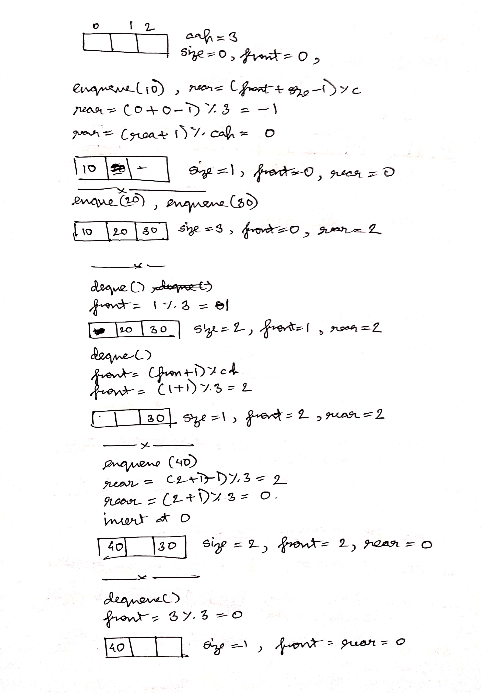

## About Queue DS
- follows FIFO i.e item which was added first will be removed first
- eg of queue:
    - pipe in a supply chain
    - any line for say train pass
- **dequeue(removal) happens at front and**
- **enqueue(addition) happens at rear end**
- operations
    - enqueue(x)
    - dequeue()
    - getFront(): gets item which was added first and will be removed first
    - getRear(): get item which was added last and will be removed last
    - isEmpty()
    - size()

## Application of Queue DS

- single resource and multiple consumers
    - eg: a ticket system, multiple consumers want to get a ticket i.e first come first serve
- In Operating Systems (FCFS - process scheduling algo, spooling, buffer for devices like keyboard)
    - in semaphores there are sleeping processes waiting in queue and whenver the resource becomes available, one of the process wakes up and consumes the resource. For this purpose a queue is maintained for which 
    - Spooling is used a printer, you can only print one print at  a time so we maintain a queue for such processes 

- Synchronization b/w slow and fast devices
    - eg: keyboard and processor, keyboard is slow device and processor is fast device, so there is a queue buffer present which takes in all the inputs of keyboard

- In computer networks 
    - in router say there are mutiple networks. There is a sender and receiver networks. Sender has high bandwidth and receiver has low bandwidth. So sender is going to send a lot of data very quickly but receiver cannot consume this data, so what router does is, it consumes data from sender and puts in a queue,
    whenever low bandwidth data becomes available, it sends out to receiver

- Variations: Deque, Priority Queue, and Doubly Ended Priority Queue

- Hence Queue finds it applications in mainly two situations:
    - when a single resource will be consumed by multiple consumers and these comsumers will be served in FCFS manner
    - synchronize slow and fast device

- [Implementation of Queue using array (Naive)](queue_array_naive.cpp)
    - front is always at idx 0 and rear=size-1
    - does dequeue in O(n) time

- [Implementation of Queue using array (Efficient)](queue_array_efficient.cpp)
    - uses circular array, all operations will be O(1)
    - 
    ```
    enqueue(): front = (front + 1)%cap;
               size--;
    dequeue(): rear = (front + size - 1)%cap;
               rear = (rear + 1)%cap;
               arr[rear] = x;
               size++; 
    ```
    - dry run for all operations
    <p align="center">
    
    </p>

- [Implementation of Queue using Linked List](queue_ll.cpp)

- [queue in C++ stl](queue_stl.cpp)
    - in STL enqueue/dequeue is push/pop
    - all operations have O(1) time
    - Queue can be implemented on any underlying container that provides the foll functions
        
        - 
        ```
        empty()
        size()
        front()
        back()
        push_back()
        pop_front()
        ```
    - these containers are ``` list or dequeue, by defualt dequeue  ```
    - hence queue is container adapter

- [Implement stack using queue](stack_using_queue.cpp)
    - Variations:
    - Implement stack using only one queue (use recursion call stack)
    - Implement queue using stack
        - by making enque() costly
        - by making deque() costly
        - by using one stack

- [Reversing a Queue](reverse_queue.cpp)