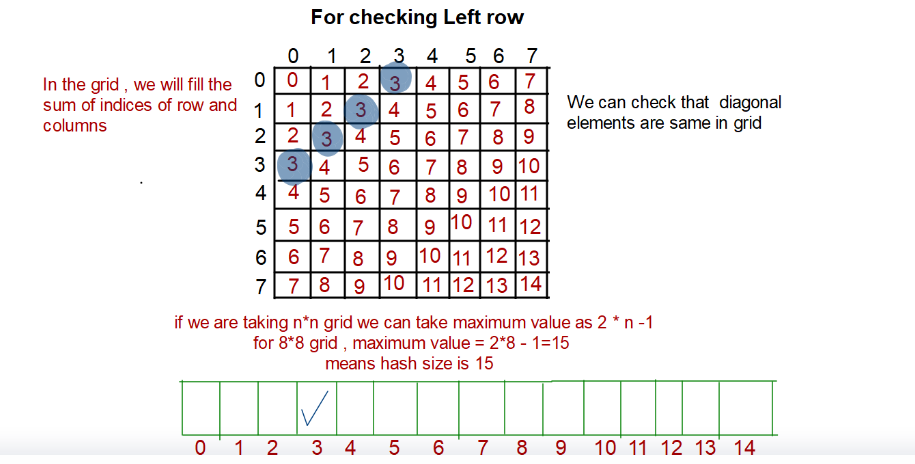
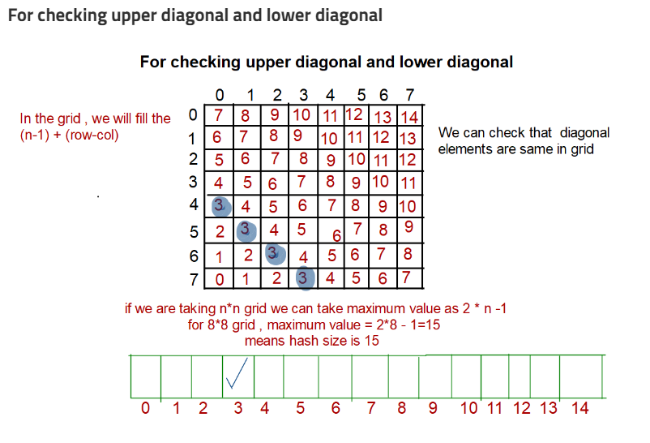

```
Given N, consider N*N chessboard and place N queens such that no two queens attack each other 
There can be multiple arrangements for a given N value, print only one output 

ip: N=3
op: No

ip: N=4
op:
0 0 1 0
1 0 0 0
0 0 0 1
0 1 0 0

ip: N=5
1 0 0 0 0
0 0 0 1 0
0 1 0 0 0 
0 0 0 0 1
0 0 1 0 0
```

**Very naive solution:** Generate ```(N^2)CN``` possible configurations where C is combinatorial i.e N^2 C N possible ways for placing N queens on N*N chessboard

**Naive solution:** 
- Every queen is going to be placed into a different row and different columns. 
- So generate all possible permutations from 0 to n-1, every permutation will represent row indexes in different columns 
- Iterate through these permutations and check, which is valid 

**Backtracking sol:**

- Place queens one by one
- As soon as we place a queen and realise, we don't have any further solution we don't go down the path, this is the optimisation
- and as soon as we find an answer, we stop at that node of recursion tree 
- Recursion tree


**Striver's sol:**

- since we have generate all possible cases, it's better to use recursion
- whenever we backtrack, make sure you remove the queen from that cell, since that queen won't lead to feasible sol 
- this process of removing queen is actual backtracking step

**Thot process**

- we are filling columns at each step, so recursive func will have ``col`` as an argument
- and we fill the queen row by row, until we find a position that is safe for the queen
- when it comes to determining whether a position is safe or not 
    - we don't need to check upwards and downwards, since every col can have at most 1 queen
    - we don't need to check right side include upper and lower right diagonals since they haven't been filled up
    - so don't need to check left side, every row can have at most 1 queen
    - so check only for entire upper left diagonal cell and lower left diagonal cells i.e ``board[row-1][col-1]`` and ``board[row+1][col-1]`` and left row.
- so finally, recursive func will have paramaters as ans 2d vector, a board vector which will be used during computations, value of n and initial column as 0

- [Striver naive code](striver_naive.cpp)
- But this sol takes ~ O(3n^2) since for n columns, we check upper left, lower left and left row which has total ``O(3n)`` complexity

**Time Optimisation:**

- This is the optimization of the issafe function. In the previous issafe function, we need ``o(N)`` for a row
- So will maintain a hash to check if the row is already occupied thus reducing the time to ```O(1)```
- for upper and lower left diagonals we try to identify a pattern 




- [Optimised Striver code](striver_optimised.cpp)