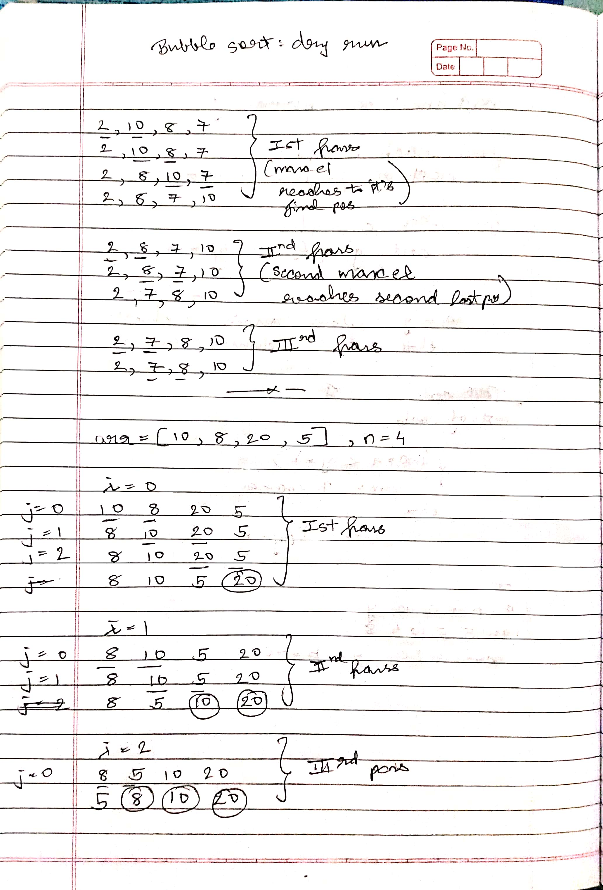
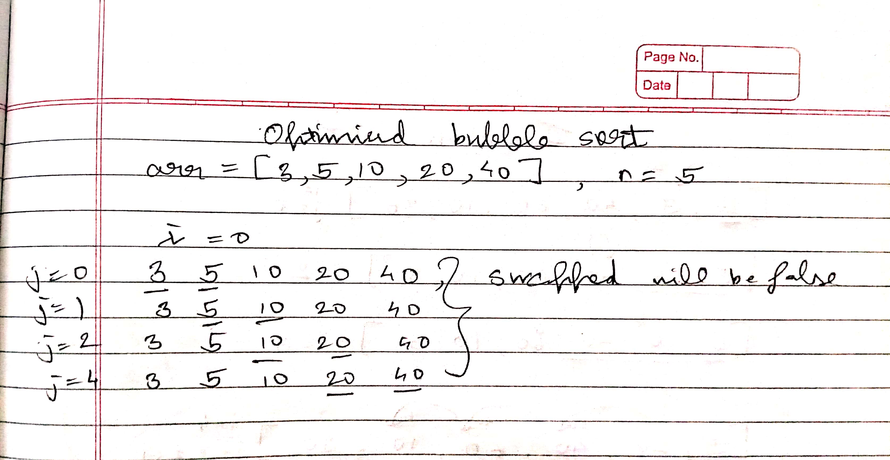
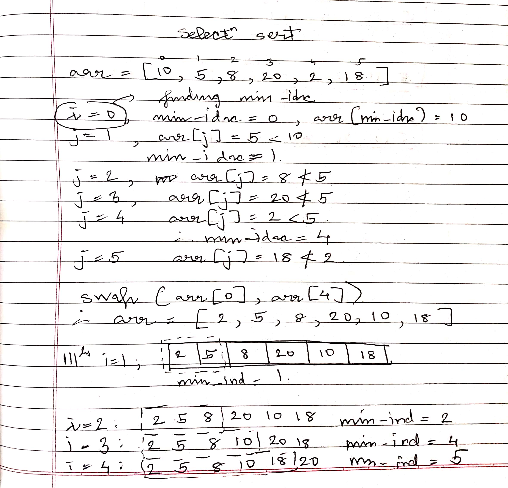
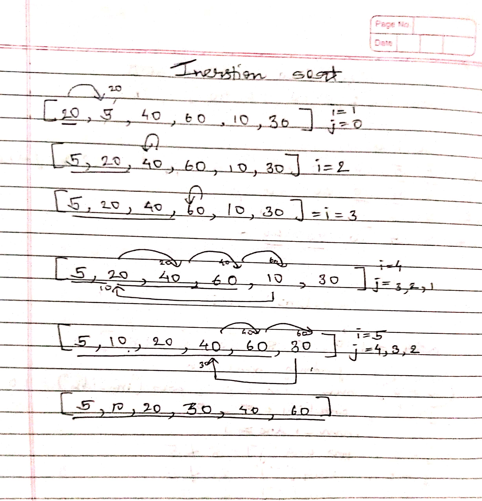
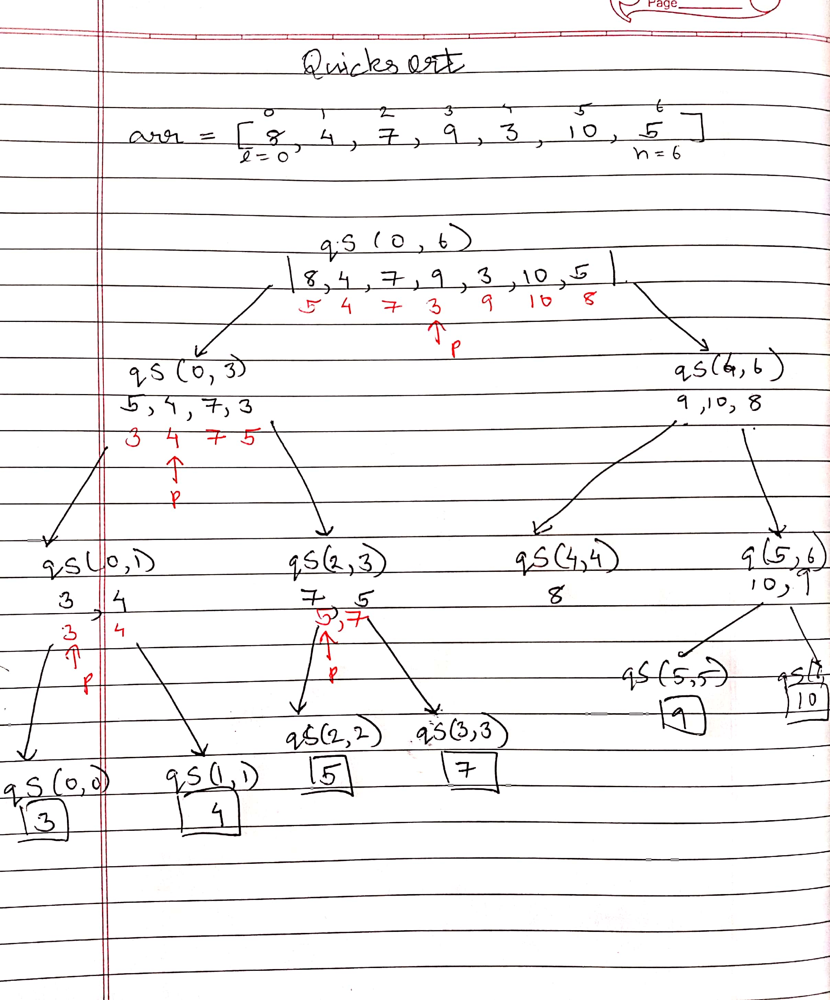

## 1. sort function in C++

- It is mainly used for data stored in containers which allow random access like normal arrays, vector, deque
- sort() expects two iterators/address
    - 1) address of first element
    - 2) address after last element 
    - 3) optional parameter: specifies order in which you want items to be sorted, mainly a comparison function that decides how array elements are to be compared. For eg: see [point](1_Sort_in_C++.cpp)
- defined in algorithm library
- internally used Introsort(Hybrid of quicksort, heap sort and insertion sort), worst case and avg case: ```O(nlogn)```

## 2. Stability of sorting algos

given an arr of students already sorted in alphabetic order of their names or lexicographically sorted

<br>

``` arr[] = {("Shyren", 50), ("Viknesh", 80), ("Piyush", 50), ("Ramesh", 80)} ```


<br>

We want to sort this in increasing order of their marks, if two students have same marks then they should appear alphabetically in op. 
This property is called stability, i.e if two items have same value then they should appear in same order as in original array
In the above eg, if we use stable sorting algo the op should be 
<br>

``` arr[] = {("Piyush", 50), ("Shyren", 50), ("Ramesh", 80), ("Viknesh", 80),  } ```

<br>

- Stable sort algos: Bubble sort, Insertion sort, Merge Sort
- Unstable sort algos: Selection sort, Quick sort, Heap Sort

## 3. Bubble sort
- comparison based algo that takes O(n^2) time 
- The algorithm has various passes, in first pass we move largest element to last position, in second pass we move second largest el to second-last position and so on until all elements are in their correct position
- for moving elements to their respective position, we compare the el with its adjacent elements, we do swapping when adj el that are being compared are out of order 
- for an array of n els, we need to do n-1 passes, since n-1  largest elements will move n-1 correct position 

```
void bubbleSort(arr, n)
{
    // n-1 passes
    for(i = 0; i < n-1; i++)
        // bubbling largest els to correct pos
        for(j = 0; j < n-1; j++)
            if(arr[j] > arr[j+1])
                swap(arr[j], arr[j+1]);
}
```
Optimisation to above code: j=0 to n-1 runs every time for every pass, after we have run one pass, one el is fixed as largest element and so on... <br>
so if we are at ith iteration then i elements are already fixed to their correct positions 
so we run j=0 to n-i-1

```
void bubbleSort(arr, n)
{
    for(i = 0; i < n-1; i++)
        for(j = 0; j < n-i-1; j++)
            if(arr[j] > arr[j+1])
                swap(arr[j], arr[j+1]);
}
```
- [dry run](imgs/bubble_sort.jpg)
<p align="center">

</p>

- Time complexity
```
if(arr[j] > arr[j+1]) -------> for i=0, runs for n-1
                               for i=1, runs for n-2
                               ..
                               i=n-2 runs for 1 time

i.e (n-1) + (n-2) +...+ 2+1
= n*(n-1)/2
= θ(n^2) 
```

- Optimisation if array is sorted or becomes sorted in middle it does not do any more work
    - maintain a swapped variable
    - after every pass re-initalise it as False 
    - for current pass check if any el has been swapped, set swapped variable in this case
    - else swapped remains false indicating no swapping happened  i.e while comparing elements we did not find any element out of order i.e array is/has become sorted

    - Code
    ```
    void bubbleSort(arr, n)
    {
        for(i = 0; i < n-1; i++)
        {
            swapped = false;
            for(j = 0; j < n-i-1; j++)
            {
                if(arr[j] > arr[j+1])
                {
                    swap(arr[j], arr[j+1]);
                    swapped = true;
                }
            }
            if(!swapped)
                break;
        }
    }
    ```
    - [dry run | does linear work ](imgs/optimised_bsort.jpg)
    <p align="center">
    
    </p>

    - Time complexity: not θ (n^2)
        - worst case: O(n^2)
        - best case: O(n)
- how to disrupt stability of bubble sort: ```arr[j] >= arr[j+1]```
- in-place sorting: does not require any extra array to copy org elements

## 4. Selection sort

- comparison based algo that takes θ(n^2) time 
- does less memory writes than quicksort, mergesort, insertion sort, etc. but cycle sort is the most optimal in terms of memory writes. Memory write is very costly operation in situations like EEP-ROM, hard-disk, since age of memory will reduce
- provides basic idea for Heap sort
- not stable
- in-place
- Idea: Find out minimum element and put it at the first position, similarly find out second minimum element and put it at second position... until arr is sorted

- Naive: we traverse the arr for finding minimum_el and put in index 0 of auxilary temp array and replace that element with INF, we do the same thing for rest of the elements and find the new min_el 
    - code

    ```
    void selectSort(arr, n)
    {
        int temp[n];

        // i == idx of temp arr
        for(int i = 0; i < n; i++)
        {
            int min_ind = 0;
            for(int j = 1; j < n; j++)
                if(arr[j] < arr[min_ind])
                    min_ind = j;
            temp[i] = arr[min_ind];
            arr[min_ind] = INF;
        }

        // copy els back to original arr
        for(int i = 0; i < n; i++)
            arr[i] = temp[i];
    }
    ```

- Optimisation: eliminate auxilary array, above naive approach is not in-place sorting, to do this we use swapping 
    - run a loop from i=0 to n-2, where elements from 0 to i are maintained to be sorted and els from i+1 to n-1 are unsorted, we try to find minimum element's index from unsorted part and store it in min_ind, once we have found the minimum element, we swap it with ```arr[i]```, 
    - Code:
    ``` 
    void selectSort(arr, n)
    {
        for(int i = 0; i < n-1; i++)
        {
            min_idx = i;
            for(int j = i + 1; j < n; j++)
                if(arr[j] < arr[min_idx])
                    min_idx = j
            swap(arr[min_ind], arr[i])
        }
    }
    ```
    - [dry run](imgs/selection_sort.jpg)
    <p align="center">
    
    </p>

    - Time complexity
    ```
    if(arr[j] < arr[min_ind]) -------> for i=0, runs for n-1
                                for i=1, runs for n-2
                                ..
                                i=n-2 runs for 1 time

    i.e (n-1) + (n-2) +...+ 2+1
    = n*(n-1)/2
    = θ(n^2) 
    ```

## 5. Insertion sort

- O(n^2) worst case
- O(n) best case 
- in-place and stable
- used in practice for small arrays (TimSort and IntraSort)
- Idea: Maintain a part that is already sorted, when we are at current element we insert this current element in already sorted array such that the array still remains sorted,  
so basically when you are on index 'i' elements from 0 to i-1 must be already sorted  
- basic dry run: <br>
[<b>20</b>, 5, 40, 60, 10, 30] i = 1<br>
[<b>5, 20</b>, 40, 60, 10, 30] i = 2<br>
[<b>5, 20, 40</b>, 60, 10, 30] i = 3<br>
[<b>5, 20, 40, 60</b>, 10, 30] i = 4<br>
[<b>5, 20, 40, 60, 10</b>, 30] i = 5<br>
[<b>5, 20, 40, 60, 10, 30</b>] <br>
- Code: begin with i=1 upto last element, for each element, we store it variable key, then we go to it's left side and find correct postion in sorted array and increase the sorted array part
```
void insertionSort(int arr[], int n)
{
    for(int i = 1; i < n; i++)
    {
        int key = arr[i];
        int j = i-1;
        // right shifting greater elements
        while(j >= 0 && arr[j] > key)
        {
            arr[j+1] = arr[j];
            j--;
        }
        arr[j+1] = key;
    }
}
```
- [dry run wrt code](imgs/insertion_sort.jpg)
<p align="center">
  
</p>

- how to destablise insertion sort: ``` arr[j] >= key ```
- TC: 
    -  Best case: already sorted - θ(n)
    -  Worst case: reverse sorted - θ(n^2)
    -  In general: O(n^2)

## 6. Merge sort
- divide and conquer algo (divide, conquer, merge)
- stable algo
- θ(nlogn) time and O(n) auxilary space
- well suited for linked lists i.e works in O(1) space
- well suited for external sorting, we can bring parts of memory to be sorted in RAM and sort those parts, by sorting the parts we can sort the entire array itself
- outperformed by quicksort in general for arrays
- before proceeding further go to  
    - [merge two sorted arrays in θ(m+n) time](2_merge_sorted_arr.cpp)
    - [merge function of merge sort](3_merge_function.cpp)
- Idea: we find midpoint of indices, we recursively sort the array from l to mid i.e first half or left half, and similarly we recusrively sort the right half.   
After sorting each half, we call merge function to sort the two sorted sub-arrays
- Code 

```
void mergeSort(int arr[], int l, int r)
{
    // check for at least two els
    if(r > l)
    {
        // m = (l+r)/2 
        int m = l + (r-1)/2;

        mergeSort(arr, l, m);
        mergeSort(arr, m+1, r);
        merge(arr, l, m, r);
    }
}
```
- [dry run](imgs/merge_sort.jpg)
<p align="center">
  
</p>
- Why space complexity is θ(n) and not θ(nlogn), since for each branch of recursion tree θ(n) space is required and there are total logn branches, so it should be θ(n)
    - Ans: At point in RAM, only θ(n) will be used, since after each recusrive call the allocated space is deallocated 

## 7. Quick sort

- divide and conquer algo (divide, conquer, partition)
- not-stable algo
- O(n^2) time 
- despite having O(n^2) time, it is considered faster than merge sort since it is
    - in-place
    - cache friendly, merge sort creates aux arrays, but quicksort does not
    - average case in O(nlogn)
    - tail recursive: if a recursive function, does recursion at a last thing, they can be re-written in loops using goto statements
- partition is key function
- before proceeding further go to  
    - [Partition function of quicksort](7_quicksort_partition.cpp)
- Idea: we have a partition algo, that takes a pivot and divides array elements around that pivot, 
those different partitions can be sorted independently until whole array gets sorted 
- Code 

```
void quickSort(int arr[], int l, int h)
{
    if(l<h)
    {
        int p = partition(arr, l, h);
        quickSort(arr, l, p);
        quickSort(arr, p+1, h);
    }
}
```
- dry run 
<p align="center">
  
</p>

### for best and worst case calculations, kindly see techknowledge

## Misc Problems:
- [Intersection of two sorted arrays, based on merge function](4_intersection.cpp)
- [Union of two sorted arrays](5_union.cpp)
- [Count inversions in an array](6_inversion.cpp)
- [Chocolate distribution problem](chocalate_dist.cpp)
- [Sort an array with two types of els](sort_two_types.cpp)
- [Sort an array with three types of els](sort_three_types.cpp)